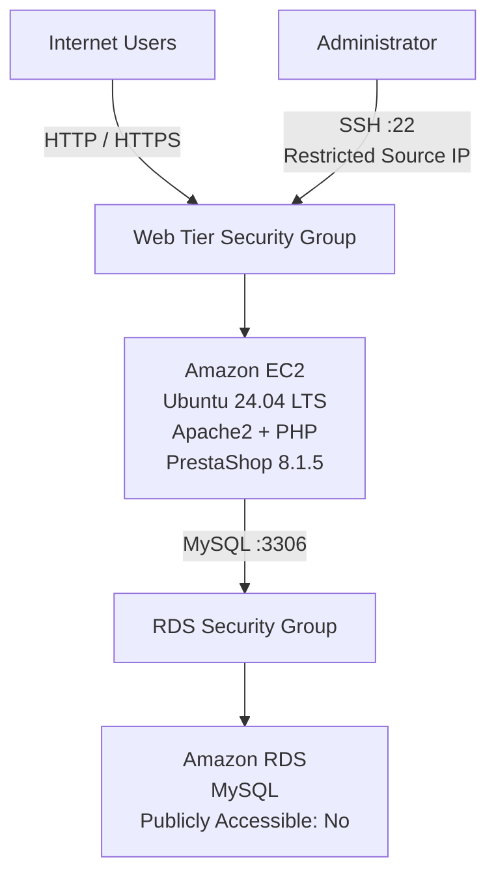
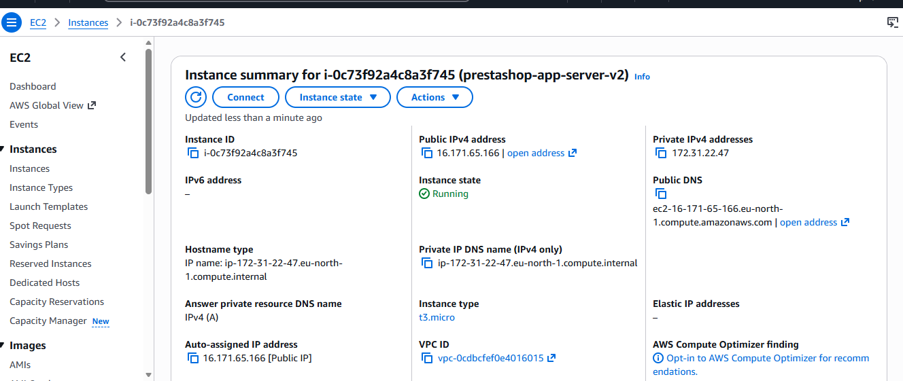
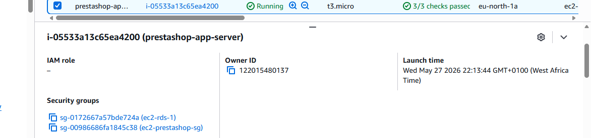
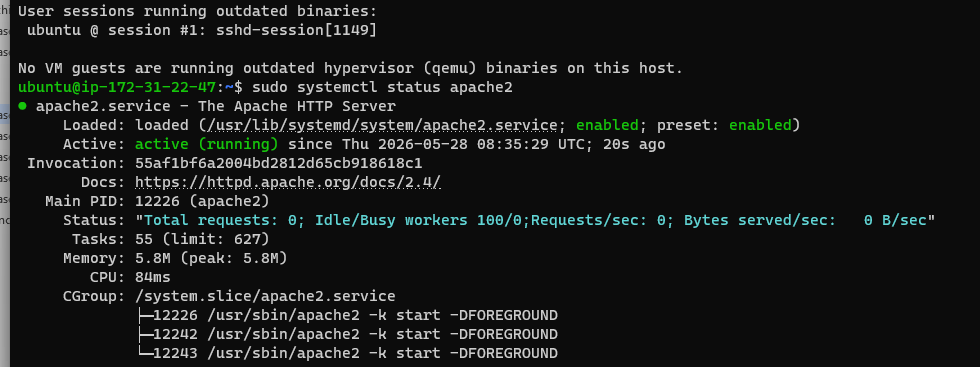
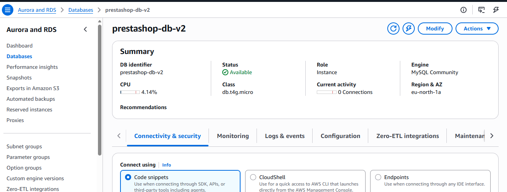
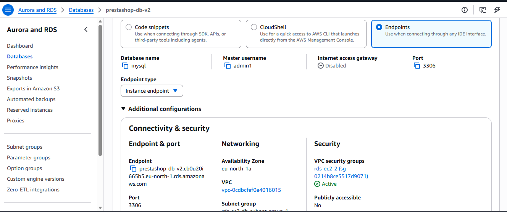
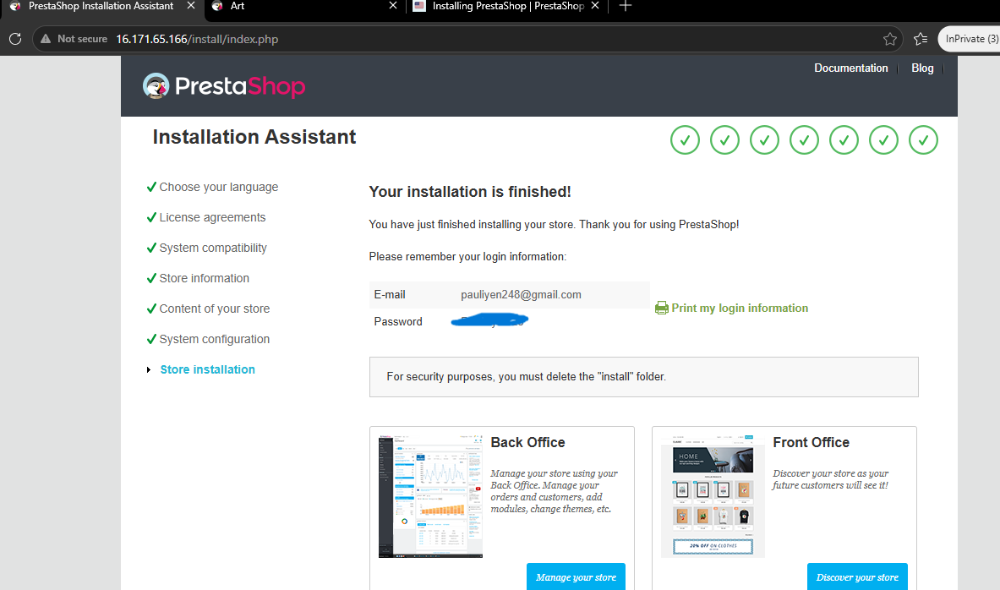
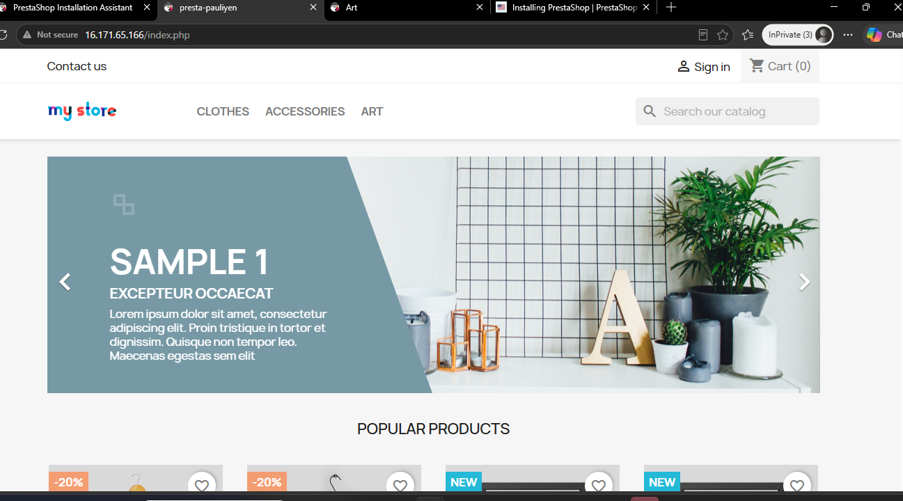

# Secure Two-Tier E-Commerce Architecture on AWS

## PrestaShop on Amazon EC2 + Amazon RDS MySQL

This project documents the end-to-end deployment of a **two-tier e-commerce application on Amazon Web Services (AWS)** using **Amazon EC2**, **Amazon RDS for MySQL**, **Ubuntu 24.04 LTS**, **Apache2**, **PHP**, and **PrestaShop 8.1.5**.

The project was built manually through the **AWS Management Console** and the **Linux command line** to strengthen practical understanding of AWS infrastructure, Linux administration, network security, database connectivity, application deployment, and structured troubleshooting.

---

## Project Objectives

The project was designed to demonstrate how to:

- Deploy a public-facing e-commerce application on Amazon EC2.
- Separate the web/application tier from the database tier.
- Use Amazon RDS for MySQL as the backend database.
- Keep the RDS database inaccessible directly from the public internet.
- Restrict SSH access to an administrator-controlled IP address.
- Allow application-to-database communication through AWS Security Groups.
- Configure Apache2, PHP, MySQL client tools, and PrestaShop.
- Verify EC2-to-RDS connectivity before application configuration.
- Troubleshoot failures methodically across infrastructure, networking, database, and application layers.
- Document a complete cloud deployment as a professional portfolio project.

---

# Architecture



### Logical Traffic Flow

```text
                         Internet
                            |
                       HTTP / HTTPS
                            |
                            v
              +-----------------------------+
              |       EC2 Web Tier          |
              |-----------------------------|
              | Ubuntu 24.04 LTS            |
              | Apache2                     |
              | PHP                         |
              | PrestaShop 8.1.5            |
              +--------------+--------------+
                             |
                             | MySQL TCP/3306
                             | controlled by
                             | Security Groups
                             v
              +-----------------------------+
              |       RDS Database Tier     |
              |-----------------------------|
              | Amazon RDS for MySQL        |
              | Public Access: Disabled     |
              +-----------------------------+
```

---

# Technology Stack

| Category | Technology |
|---|---|
| Cloud Provider | Amazon Web Services |
| Region | Europe (Stockholm), `eu-north-1` |
| Compute | Amazon EC2 |
| Database | Amazon RDS for MySQL |
| Operating System | Ubuntu 24.04 LTS |
| Web Server | Apache2 |
| Runtime | PHP |
| Application | PrestaShop 8.1.5 |
| Database Client | MySQL Client |
| Security | AWS Security Groups |
| Administration | SSH |
| Local Terminal | Windows PowerShell |

---

# Repository Structure

```text
aws-secure-two-tier-prestashop/
│
├── README.md
│
└── images/
    ├── ec2-instance.png
    ├── ec2-instance-security-groups.png
    ├── apache-service-running.png
    ├── rds-instance1.png
    ├── rds-instance2.png
    ├── prestashop-installation-complete.png
    └── prestashop-store-front.png
```

---

# Deployment Walkthrough

## Phase 0 — Environment Preparation

Before the final deployment, older AWS resources from previous attempts were removed to reduce configuration conflicts and create a cleaner deployment environment.

Actions included:

- Terminating legacy EC2 instances.
- Removing the previous RDS database.
- Removing deprecated Security Groups.
- Rebuilding the environment with clearer separation between the application and database tiers.

This made the final environment easier to understand and troubleshoot.

---

## Phase 1 — Provision the EC2 Web/Application Tier

An **Ubuntu 24.04 LTS** Amazon EC2 instance was provisioned as the public-facing application server.

### EC2 Configuration

- **Instance type:** `t3.micro`
- **Operating system:** Ubuntu 24.04 LTS
- **Authentication:** RSA SSH key pair
- **Administrative access:** SSH restricted to the administrator's IP address
- **Public web access:** HTTP/HTTPS rules configured on the web-tier Security Group

### EC2 Instance

<p align="center">
  
</p>

<p align="center">
  <em>Amazon EC2 instance used as the PrestaShop application server.</em>
</p>

### EC2 Security Groups

The EC2 web tier was associated with Security Groups controlling administrative access, public web traffic, and database connectivity.

<p align="center">
  
</p>

<p align="center">
  <em>Security Groups associated with the EC2 application tier.</em>
</p>

### Web-Tier Access Rules

| Port | Protocol | Source | Purpose |
|---:|---|---|---|
| 22 | TCP | Administrator IP only | SSH administration |
| 80 | TCP | `0.0.0.0/0` | Public HTTP traffic |
| 443 | TCP | `0.0.0.0/0` | Public HTTPS traffic |

The database access path was handled separately so MySQL was not exposed directly to the public internet.

---

## Phase 2 — Connect to EC2 and Configure Apache

The EC2 server was accessed from Windows PowerShell using SSH.

```bash
ssh -i <SSH_KEY>.pem ubuntu@<EC2_PUBLIC_IP>
```

> Sensitive infrastructure values are represented with placeholders in this documentation.

### Update the Operating System

```bash
sudo apt update && sudo apt upgrade -y
```

### Install Apache2

```bash
sudo apt install apache2 -y
```

### Verify Apache Service

```bash
sudo systemctl status apache2
```

<p align="center">
  
</p>

<p align="center">
  <em>Apache2 verified as active and running on the Ubuntu EC2 instance.</em>
</p>

This confirmed that the web server was installed and operational before application deployment continued.

---

## Phase 3 — Provision the Amazon RDS MySQL Database

A separate **Amazon RDS for MySQL** instance was created for the backend database tier.

### RDS Configuration

- **Database service:** Amazon RDS
- **Database engine:** MySQL
- **Port:** `3306`
- **Publicly accessible:** No
- **Application access:** controlled through Security Group rules
- **Endpoint:** represented as `<RDS_ENDPOINT>` in this repository

### RDS Instance

<p align="center">
  
</p>

<p align="center">
  <em>Amazon RDS MySQL instance provisioned as the backend database tier.</em>
</p>

### RDS Connectivity and Security

<p align="center">
  
</p>

<p align="center">
  <em>RDS connectivity and security configuration, including non-public database access.</em>
</p>

The database was kept separate from the public-facing application server. Database traffic was permitted only through the intended EC2-to-RDS path.

---

## Phase 4 — Install PHP and Database Dependencies

The PHP runtime and required PrestaShop dependencies were installed on the EC2 application server.

```bash
sudo apt install \
php \
libapache2-mod-php \
php-mysql \
php-curl \
php-gd \
php-mbstring \
php-xml \
php-zip \
php-intl \
php-bcmath \
unzip \
mysql-client \
-y
```

Apache was restarted after installing the required packages:

```bash
sudo systemctl restart apache2
```

---

## Phase 5 — Verify EC2-to-RDS Connectivity

Before configuring PrestaShop, connectivity between the application server and database server was tested independently.

```bash
mysql -h <RDS_ENDPOINT> -u <DB_ADMIN_USER> -p
```

The connection succeeded.

This test confirmed that:

- The RDS endpoint resolved correctly.
- The EC2 instance could reach RDS across the AWS network.
- Security Group rules allowed the required traffic.
- MySQL port `3306` was reachable.
- Database authentication worked.

Testing the database connection independently helped separate infrastructure issues from application-level configuration problems.

---

## Phase 6 — Deploy PrestaShop

The default Apache web page was removed:

```bash
cd /var/www/html
sudo rm index.html
```

PrestaShop 8.1.5 was downloaded:

```bash
sudo wget https://github.com/PrestaShop/PrestaShop/releases/download/8.1.5/prestashop_8.1.5.zip
```

The archive was extracted:

```bash
sudo unzip prestashop_8.1.5.zip
```

Apache ownership was applied to the application files:

```bash
sudo chown -R www-data:www-data /var/www/html/
```

File permissions were configured:

```bash
sudo chmod -R 755 /var/www/html/
```

---

# Troubleshooting

Troubleshooting was a major part of the project.

Rather than changing several settings at once, each issue was isolated systematically.

---

## Issue 1 — Apache Rewrite Module Disabled

### Problem

The PrestaShop compatibility check reported that the Apache rewrite module required by the application was not enabled.

### Resolution

```bash
sudo a2enmod rewrite
sudo systemctl restart apache2
```

After Apache restarted, the required rewrite functionality became available.

---

## Issue 2 — Application Reached RDS but Database Was Missing

### Problem

PrestaShop successfully authenticated with the RDS MySQL server but could not find the required application database.

Because EC2-to-RDS connectivity had already been tested successfully using the MySQL client, the networking layer could be ruled out.

### Resolution

Connect to RDS:

```bash
mysql -h <RDS_ENDPOINT> -u <DB_ADMIN_USER> -p
```

Create the PrestaShop database:

```sql
CREATE DATABASE prestashop;
```

After creating the database, the installation process was able to continue.

---

# Troubleshooting Methodology

The deployment was validated layer by layer:

```text
Is the EC2 instance running?
            |
            v
Can SSH access reach the instance?
            |
            v
Is Apache running?
            |
            v
Can public HTTP traffic reach the server?
            |
            v
Is the RDS instance available?
            |
            v
Does the RDS endpoint resolve?
            |
            v
Can EC2 reach RDS on TCP/3306?
            |
            v
Does MySQL authentication work?
            |
            v
Does the required database exist?
            |
            v
Are the required PHP dependencies installed?
            |
            v
Is PrestaShop configured correctly?
```

This approach helped identify whether a failure belonged to:

- AWS compute
- AWS networking
- Security Groups
- Linux
- Apache
- PHP
- MySQL
- Amazon RDS
- PrestaShop

---

# Deployment Result

## PrestaShop Installation Completed

After the Apache and database configuration issues were resolved, the PrestaShop installation completed successfully.

<p align="center">
  
</p>

<p align="center">
  <em>Successful completion of the PrestaShop installation process.</em>
</p>

## Final Storefront

The final storefront was successfully served from the EC2 web/application tier.

<p align="center">
  
</p>

<p align="center">
  <em>Final PrestaShop storefront running on the AWS-hosted application tier.</em>
</p>

---

# Security Design

## Restricted SSH Access

Administrative SSH access on port `22` was restricted to the administrator's source IP rather than being globally accessible.

## Database Isolation

The RDS MySQL instance was configured with **public accessibility disabled**.

## Tier Separation

The public-facing web server and database were deployed as separate infrastructure components instead of hosting MySQL directly on the EC2 application server.

## Security Group-Based Communication

The database tier accepted application traffic through controlled Security Group rules rather than exposing MySQL directly to the internet.

## Host Patching

The Ubuntu server was updated before the application stack was installed.

---

# Skills Demonstrated

## AWS

- Amazon EC2
- Amazon RDS
- AWS Security Groups
- EC2-to-RDS connectivity
- Cloud resource provisioning
- AWS network access control

## Linux Administration

- Ubuntu server administration
- SSH
- `apt` package management
- Apache service management
- Linux ownership with `chown`
- Linux permissions with `chmod`
- Command-line troubleshooting

## Networking

- TCP/IP ports
- HTTP/HTTPS access rules
- MySQL port `3306`
- Public vs. non-public resources
- Security Group traffic control
- DNS endpoint resolution
- Application-to-database connectivity

## Database

- Amazon RDS for MySQL
- MySQL client
- Remote database authentication
- Database creation
- Application/database integration

## DevOps / Cloud Engineering

- Cloud application deployment
- Environment preparation
- Service configuration
- Dependency installation
- Deployment validation
- Layered troubleshooting
- Technical documentation

## Security

- Restricted administrative access
- Database isolation
- Reduced public exposure
- Separation of application and database tiers
- Security Group-based service communication

---

# Key Lessons Learned

### 1. Public applications and databases should not have the same exposure

The web tier needs to receive internet traffic. The database tier does not need direct public access.

### 2. Test infrastructure independently

Testing MySQL directly from EC2 confirmed the network path and authentication before troubleshooting PrestaShop itself.

### 3. Security Groups define trust boundaries

Security Groups can be used to control exactly which infrastructure components are permitted to communicate.

### 4. Troubleshoot one layer at a time

Separating compute, networking, operating system, web server, database, runtime, and application checks makes cloud failures easier to diagnose.

### 5. Documentation is part of engineering

Recording deployment steps, decisions, failures, and fixes makes an infrastructure project easier to review, explain, and improve.

---

# Future Improvements

The first version of this project was intentionally built manually to strengthen understanding of the underlying AWS services.

Future improvements include:

- Rebuild the infrastructure using **Terraform**
- Design explicit public and private subnets
- Add an **Application Load Balancer**
- Add **Auto Scaling**
- Configure HTTPS/TLS using **AWS Certificate Manager**
- Add **Amazon Route 53**
- Store credentials using **AWS Secrets Manager**
- Add **Amazon CloudWatch** metrics, logs, and alarms
- Add automated RDS backup and recovery testing
- Introduce CI/CD automation
- Add AWS WAF
- Add infrastructure security scanning
- Evaluate Multi-AZ RDS for improved availability

A Terraform version would make the infrastructure reproducible and allow the architecture to be rebuilt consistently from code.

---

# Project Status

| Item | Status |
|---|---|
| EC2 Web Tier | Completed |
| Apache Configuration | Completed |
| PHP Dependencies | Completed |
| RDS MySQL Tier | Completed |
| EC2-to-RDS Connectivity | Verified |
| PrestaShop Installation | Completed |
| Storefront Deployment | Completed |
| Documentation | Completed |

---

# Author

**Paul Iyen**  
Junior DevOps / Cloud Engineer

Focus areas:

`AWS` · `Terraform` · `Docker` · `Kubernetes` · `CI/CD` · `Python` · `Linux` · `Cloud Security`